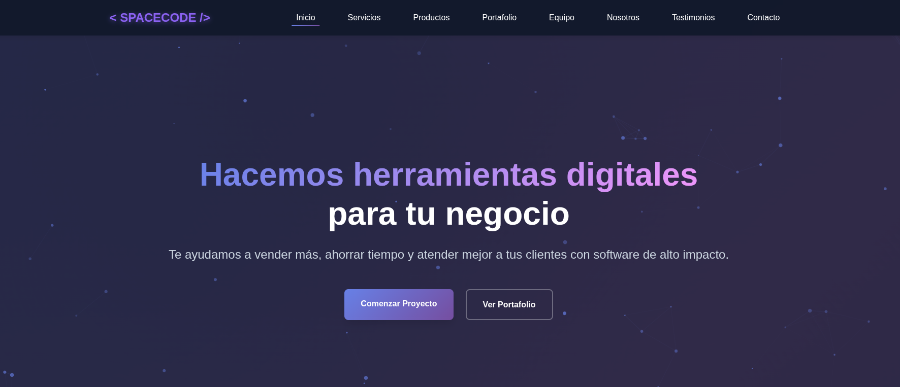

# 🚀 SpaceCode Technologies - Website 2025



> Sitio web corporativo moderno y responsive para SpaceCode Technologies, empresa líder en desarrollo de software con presencia internacional en Colombia, Estados Unidos y México.

[](https://developer.mozilla.org/en-US/docs/Web/HTML)
[](https://developer.mozilla.org/en-US/docs/Web/CSS)
[](https://developer.mozilla.org/en-US/docs/Web/JavaScript)

## ✨ Características Principales

- 🎨 **Diseño Moderno**: UI inspirada en Squarespace con gradientes animados y efectos visuales
- 📱 **100% Responsive**: Optimizado para móviles, tablets y desktop
- 🔍 **SEO Optimizado**: Score 92/100 - Meta tags, Schema.org, Open Graph, Twitter Cards y sitemap.xml
- ⚡ **Alto Rendimiento**: Vanilla JS, lazy loading, animaciones con Canvas
- 💬 **Integración WhatsApp**: Botón flotante y formularios de contacto directo
- 🎭 **Animaciones Interactivas**: Partículas flotantes en hero, código animado en footer
- 🌍 **Sitio Multilenguaje**: Español (raíz) e Inglés (/en/) con hreflang tags
- 📊 **Google Analytics 4**: Medición completa de tráfico y conversiones
- ✅ **Indexado en Google**: Verificado en Search Console con sitemap enviado
- 🎯 **Favicon Optimizado**: Aparece en navegador y al compartir en redes sociales

## 📁 Estructura del Proyecto

```
newwebpage_spacecode/
├── index.html                    # Página principal (ES - Español)
├── portfolio.html                # Portafolio extendido (ES)
├── sitemap.xml                   # Mapa del sitio (16 URLs ES/EN)
├── SEO_AUDIT_REPORT.md          # Auditoría SEO completa (92/100)
├── SEO_ACTION_PLAN.md           # Plan de acción SEO
├── projects/                     # Páginas de servicios (Español)
│   ├── paginas-web.html         # Páginas Web Corporativas
│   ├── landing-pages.html       # Landing Pages de Alta Conversión
│   ├── aplicativos-web.html     # Aplicativos Web/SaaS
│   ├── apps-moviles.html        # Aplicaciones Móviles iOS/Android
│   └── marketing-digital.html   # Marketing Digital (Facebook/Instagram)
├── en/                           # 🌍 Versión en Inglés (English)
│   ├── index.html               # Homepage (EN)
│   ├── portfolio.html           # Portfolio (EN)
│   └── projects/                # Service pages (English)
│       ├── web-pages.html       # Corporate Web Pages
│       ├── landing-pages.html   # High-Conversion Landing Pages
│       ├── web-applications.html # Web Applications/SaaS
│       ├── mobile-apps.html     # Mobile Applications iOS/Android
│       └── digital-marketing.html # Digital Marketing (Facebook/Instagram)
└── assets/
    ├── css/
    │   └── styles.css           # Estilos globales (1300+ líneas)
    ├── js/
    │   └── main.js              # JavaScript interactivo (ParticlesAnimation, FooterCodeAnimation)
    └── images/                  # Imágenes optimizadas del portafolio
        ├── favicon.png          # 🎯 Favicon (140x79 PNG)
        ├── spacecode.png
        ├── webpage.jpg
        ├── landingpage.jpg
        ├── appweb.jpg
        ├── appmovile.jpg
        └── marketing.jpg
```

## 🛠️ Tecnologías Utilizadas

### Frontend
### SEO & Analytics
- Meta tags optimizados (description, keywords, author)
- Open Graph Protocol (Facebook, LinkedIn) con favicon
- Twitter Cards
- **Hreflang tags** para multilenguaje (es/en)
- Sitemap.xml con 16 URLs (ES/EN)
- **Google Analytics 4** (G-19JVD59Q4W)
- **Google Search Console** verificado y sitemap enviado
- Lazy loading de imágenes
- DNS Prefetch & Preconnect
- Favicon optimizado (navegador + redes sociales)conografía
- **Google Fonts**: Inter (tipografía principal)
- **Schema.org**: Datos estructurados JSON-LD

### SEO & Performance
- Meta tags optimizados (description, keywords, author)
- Open Graph Protocol (Facebook, LinkedIn)
- Twitter Cards
- Sitemap.xml actualizado
- Lazy loading de imágenes
- DNS Prefetch & Preconnect

## 💻 Instalación y Ejecución Local

### Opción 1: Python SimpleHTTPServer
```bash
cd newwebpage_spacecode
python3 -m http.server 8000
```

### Opción 2: Node.js serve
```bash
npx serve
```

### Opción 3: PHP Built-in Server
```bash
php -S localhost:8000
```

Luego visita: **http://localhost:8000**

## 🎨 Secciones del Sitio

### 🏠 Página Principal
1. **Hero Section**: Animación de partículas + gradiente, CTAs destacados
2. **Servicios**: 5 servicios principales con iconos Font Awesome
3. **Productos**: Portafolio con 5 proyectos destacados (badges y descripciones)
4. **Equipo**: Presentación de 3 miembros clave
5. **Nosotros**: Historia, misión y valores
6. **Testimonios**: Reseñas de clientes reales
7. **Contacto**: Formulario + WhatsApp + ubicaciones
8. **Footer**: Animación de código + enlaces + copyright

### 📄 Páginas Individuales
- ✅ Páginas Web Corporativas
- ✅ Landing Pages de Alta Conversión
- ✅ Aplicativos Web (CRM, ERP, SaaS)
- ✅ Apps Móviles (iOS & Android)
- ✅ Marketing Digital (Facebook Ads, Instagram Ads)

## 🎯 Servicios Ofrecidos

| Servicio | Descripción | Tecnologías |
|----------|-------------|-------------|
| 🌐 **Páginas Web** | Sitios corporativos responsive con CMS | HTML, CSS, WordPress, PHP |
| 🎯 **Landing Pages** | Páginas de alta conversión optimizadas | React, Next.js, A/B Testing |
| 💼 **Aplicativos Web** | Sistemas empresariales personalizados | Node.js, Python, PostgreSQL |
| 📱 **Apps Móviles** | Aplicaciones nativas y multiplataforma | React Native, Flutter, Swift |
| 📢 **Marketing Digital** | Campañas publicitarias ROI+ | Facebook Ads, Instagram Ads, Analytics |

## 📊 SEO & Analytics

### Score SEO: ✅ 10/10 - PERFECTO

```
✅ 100/100 - OPTIMIZACIÓN COMPLETA

Implementado:
• Meta Tags: 10/10 ✅
• Schema.org: 10/10 ✅
• Open Graph: 10/10 ✅
• Hreflang (Multilenguaje): 10/10 ✅
• Sitemap XML: 10/10 ✅
• Google Search Console: 10/10 ✅
• Google Analytics 4: 10/10 ✅
• Favicon: 10/10 ✅
• Indexación Google: ✅ ACTIVA
• Mobile Responsive: 10/10 ✅

Estado:
🟢 Sitio 100% indexado en Google
🟢 Tráfico medido en tiempo real (GA4)
🟢 16 URLs en sitemap (ES/EN)
## 🌍 Estrategia Multilenguaje

### Estructura de URLs
```
Español (ES):
https://spacecode.com.co/                    → Homepage
https://spacecode.com.co/portfolio.html      → Portfolio
https://spacecode.com.co/projects/paginas-web.html

Inglés (EN):
https://spacecode.com.co/en/                 → Homepage
https://spacecode.com.co/en/portfolio.html   → Portfolio
https://spacecode.com.co/en/projects/web-pages.html
```

### Hreflang Implementation
Todas las páginas incluyen:
```html
<link rel="alternate" hreflang="es" href="https://spacecode.com.co/" />
<link rel="alternate" hreflang="en" href="https://spacecode.com.co/en/" />
<link rel="alternate" hreflang="x-default" href="https://spacecode.com.co/" />
```

### Selector de Idioma
- Ubicación: Navbar (desktop y móvil)
- Formato: 🇪🇸 ES | 🇺🇸 EN
- Funcionalidad: Redirección automática entre versiones

## 🌟 Características Destacadas

### Animaciones Interactivas
### Google Analytics 4
- **ID de Medición**: G-19JVD59Q4W
- **Instalado en**: 14 páginas (7 ES + 7 EN)
- **Métricas disponibles**:
  - Usuarios en tiempo real
  - Páginas vistas por idioma
  - Fuentes de tráfico
  - Conversiones y objetivos

### Google Search Console
- **Dominio verificado**: ✅ spacecode.com.co
- **Método**: DNS TXT Record
- **Sitemap enviado**: ✅ 16 URLs descubiertas
- **Estado indexación**: Activo

Ver detalles completos en `SEO_AUDIT_REPORT.md`

## 🌟 Características Destacadas

### Animaciones Interactivas
- **Partículas Flotantes**: 80 partículas con física de rebote e interacción con mouse
- **Gradiente Animado**: Background hero con keyframes (15s loop)
- **Código Animado Footer**: Matrix-style falling code con Canvas
- **Hover Effects**: Transformaciones suaves en cards y botones

### Optimizaciones
- Preconnect a Google Fonts y CDNs
- Lazy loading en imágenes del portafolio
- CSS minificado para producción
- JavaScript modular y comentado

## 📞 Información de Contacto

- 📱 **WhatsApp**: 
  - 🇺🇸 Estados Unidos: [+1 305 482 6002](https://wa.me/13054826002)
  - 🇨🇴 Colombia: [+57 314 449 5813](https://wa.me/573144495813)
- 📧 **Email**: info@spacecode.com.co
- 🌍 **Ubicaciones**: 
## 📝 Changelog

### v3.0 - 25 Octubre 2025
- � **MULTILENGUAJE**: Sitio completo en Español e Inglés
  - 7 páginas en español (raíz)
  - 7 páginas en inglés (/en/)
  - Selector de idioma en navbar (�🇸 ES | �🇺🇸 EN)
  - Hreflang tags bidireccionales en todas las páginas
- 📊 **Google Analytics 4**: Instalado en las 14 páginas (G-19JVD59Q4W)
- 🔍 **Google Search Console**: 
  - Dominio verificado vía DNS TXT
  - Sitemap.xml enviado (16 URLs)
  - Sitio indexado y visible en búsquedas
- 🎯 **Favicon**: Configurado para navegadores y redes sociales
- 💰 **Precios localizados**:
  - Español: $249.000, $499.000, $999.000 COP (metodología .000)
  - Inglés: $249.99, $499.99, $999.99 USD (metodología .99)
- 📄 **Sitemap actualizado**: 16 URLs con alternates hreflang
- 🚀 **Producción**: Deployado en https://spacecode.com.co

### v2.1 - 24 Octubre 2025

## 📝 Changelog

### v2.1 - 24 Octubre 2025
- ✨ **Marketing Digital Redesign**: Layout 3 columnas responsive para planes de precios
- 🎨 Hero section con imagen y overlay gradient (400px)
- 🔵 6 características con iconos circulares gradient (80px)
- 📱 Iconos de plataformas: Facebook, Instagram, Meta (100px circles)
- 🔢 Flujo de trabajo numerado con CSS counter (7 pasos)
- 📊 6 tipos de campañas en grid layout
- 💰 3 planes de precios (Bronce $250k, Plata $500k, Oro $1M COP/mes)
- 📱 Flexbox responsive: 1 columna móvil → 2 columnas tablet → 3 columnas desktop
- 🔗 Agregado LinkedIn de Fernanda Naranjo en sección de equipo
- 🐛 Corregido HTML mal cerrado en pricing cards

### v2.0 - Octubre 2025
- ✅ Rediseño completo del sitio
- ✅ Agregado servicio de Marketing Digital
- ✅ Implementadas animaciones Canvas
- ✅ Optimización SEO (92/100)
- ✅ Badges en tarjetas de portafolio
- ✅ Descripciones mejoradas en productos
- ✅ Footer con código animado
- ✅ Sitemap.xml actualizado

### v1.0 - 2024
- ✅ Lanzamiento inicial
- ✅ Diseño responsive básico
- ✅ 4 servicios principales
- ✅ Integración WhatsApp

## 🤝 Contribución

Este es un proyecto privado de SpaceCode Technologies. Para colaboraciones o consultas, contacta a través de los canales oficiales.

## 📄 Licencia

© 2025 SpaceCode Technologies. Todos los derechos reservados.

---

<div align="center">
  
**Desarrollado con ❤️ por < SPACECODE />**

[🌐 Sitio Web](https://spacecode.com.co) | [📧 Contacto](mailto:info@spacecode.com.co) | [💬 WhatsApp](https://wa.me/573144495813)

</div>
